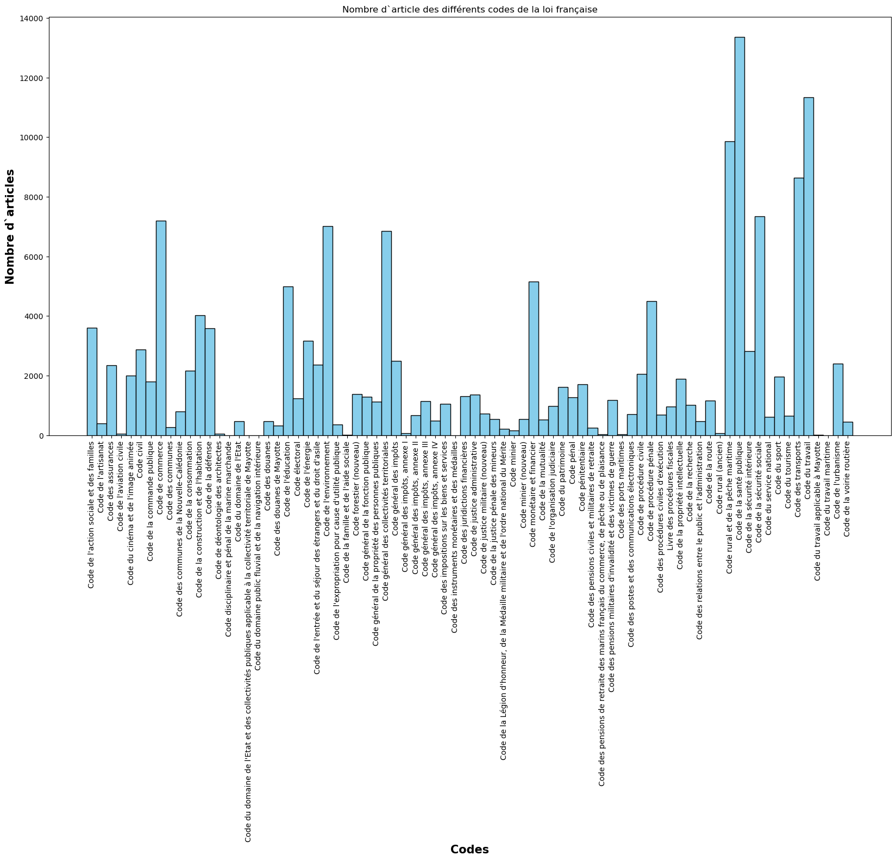
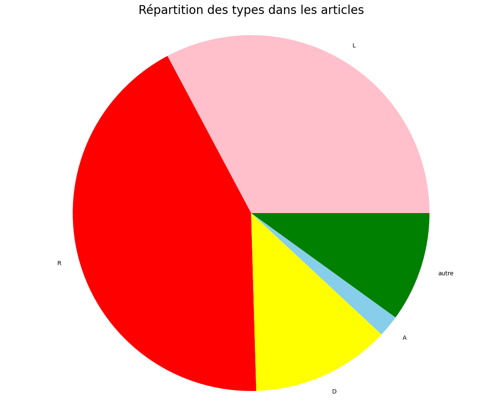
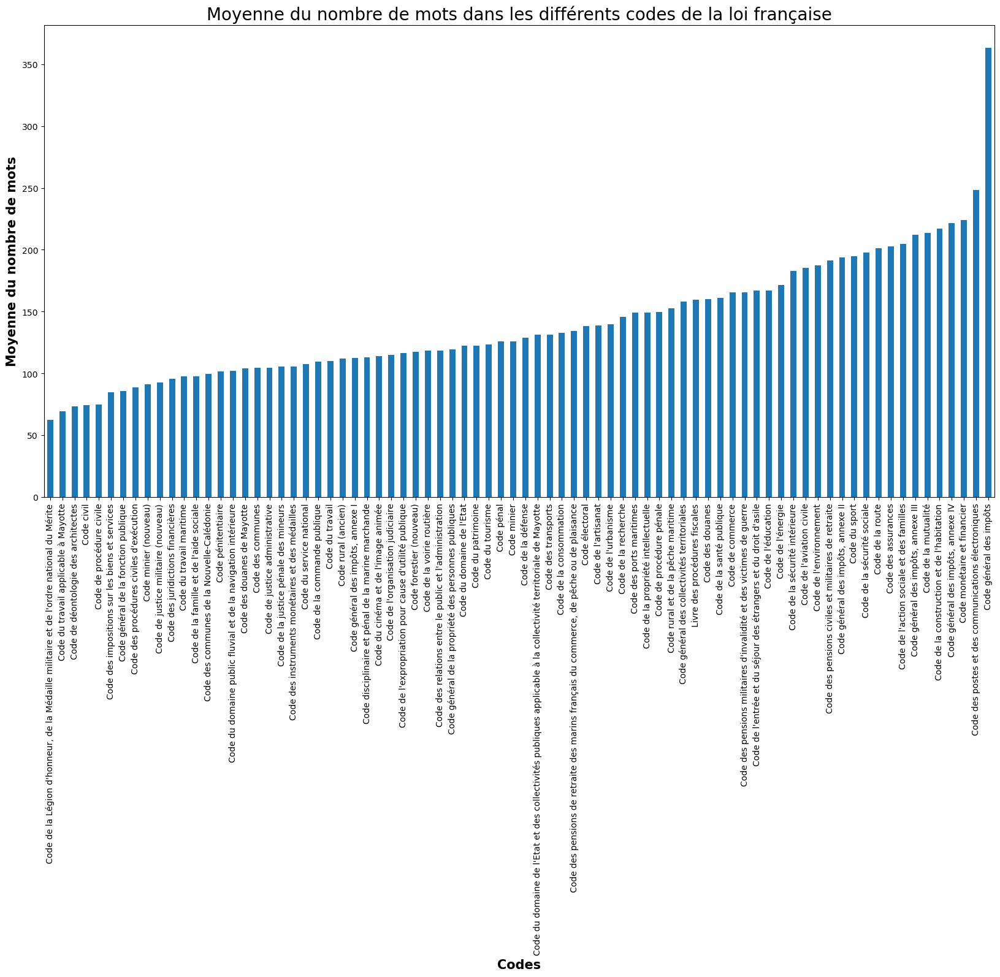
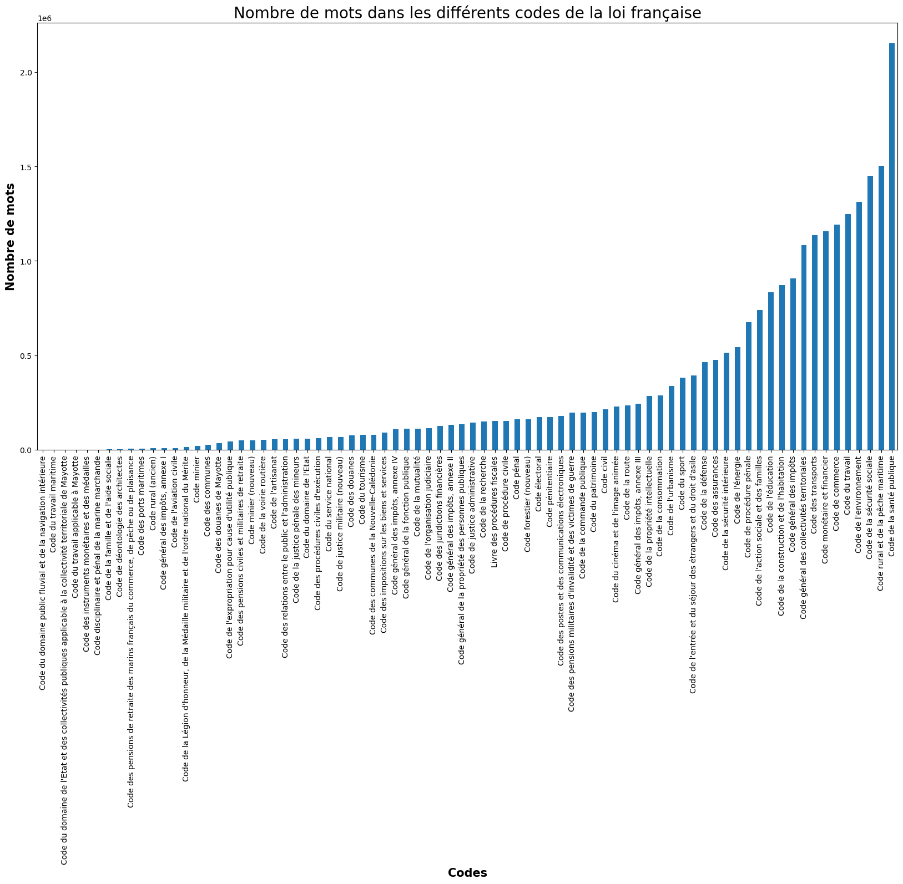

# outils_traitement_corpus
Projet d'outils de traitements de corpus - Alix Sirven-Viénot - M1 TAL (Nanterre) 

## Semaine 1 
### Choix du corpus de référence 
Pour le choix du corpus, j'ai choisi de reproduire ce dataset de la loi japonaise. 
Après discussion avec une amie qui fait des études de droit, je me suis rendu que les codes de lois et les décisions de justice était une source de corpus très riche. Il n'existe pas tant de ressource et d'annalyse sur ce genre de corpus. Il existe aussi peu de ressources pour aider les étudiants en droit à faire des liens entre lois et décisions de justice ou pour de la recherche d'information dans les textes de loi. 

Sur le site hugging face j'ai trouvé ce corpus de la loi japonaise qui me semblait reproductible dans le temps imparti.  

Voici le lien vers le corpus : https://huggingface.co/datasets/y2lan/japan-law
Ce dataset contient 5 colonnes: 
- num : le numéro de la loi (e.g., Reiwa 5th Year Pollution Adjustment Committee Rule No. 1)
- title : le titre de la loi 
- id : son identifiant unique
- date: sa date de mise en effet 
- body : le texte  de la loi en entier

La licence de ce dataset appartient au MIT
Il a été créé pour perfomer les taches suivantes:
  - summarization
  - text-generation
  - question-answering
Il est entièrement en japonnais. Il contient 8.75k textes de lois (1K < n < 10K).  
La dernière modification de ce coprus date du 1er Aout 2023, il s'agissait de la déduplication des données.

### Création du corpus 
Pour recréer un de ces corpus, j'ai trouvé ce site qui regroupe les codes du droit français aux formats pdf, rss et xml: https://codes.droit.org/ .    
Il contient les 78 codes de la loi française.  

Ce corpus peut avoir plusieurs usages comme expliqué pour le corpus de référence.   
Dans ce cas présent nous allons l'utiliser pour une tâche de classification.  
Il devra classer les articles selon 
- le code auquel il appartient et 
- s'il sagit d'une loi, d'une réglementation, d'un décret ou d'une annexe 

## Semaine 2 - Récupération des données 
Absente ce jour là, mais si j'ai a peu près compris:  
- récupération de données pour création du corpus  
- faire un script pour faire du scrapping (à partir d'un lien en récupérer plein)  
- donne un fichier CSV avec les colonnes de notre corpus final    

### Script de scrapping 
Ça marche!   
Pour le récupérer les articles de loi nous allons utiliser ce site : https://codes.droit.org/ . 
Pour commencer: récupération de tous les liens xml des codes.  
Puis récupération des infos pour chaque article de chaque code de lois 
Utilisation des librairies: Requests, Beautiful soup et lxml.  
<!-- Beautiful soup très lent - bizzaroïde demandé si peut faire autre technique.  -->

Pour le remplissage des colones:  
- num des lois :  chemin vers les lois (ex: code > Partie (législative/réglementaire/decret/annexes) > Livre nbr > Titre nbr > Chapitre nbr > article nbr ) 
- title : numéro de l'article suivit du nom du code auquel il appartient (ex: L5511-2-1 du Code de la santé publique)
- id : l'id officiel de l'article commençant par LEGIART+diggit (ex: LEGIARTI000006796412)
- date: la date de mise en effect, au format YYYY-MM-DD (ex: 2020-02-12)
- body : le texte de loi 
Ajout de trois colonnes de plus que le corpus d'origine : 
- modTitle : le titre donné à la dernière modification de l'article (ex: décret numéro)
- code : le nom du code de loi auquel il appartient 
- type : quatre types d'articles selon leur origine : https://reflex.sne.fr/codes-officiels  
  - L : issu d'une loi (le pouvoir législatif)
  - R : issu d'un décret (les réglementations)  
  - D : issu d'un décret
  - A : issu d'un arrêté ou une annexe 
  - autres: pour quelques codes, on ne trouve pas de type (ex: le code civil) dans cette colonne on trouvera alors le premier chiffre de son numéro (remplacé par autre après) 
- nbr_mot: le nombre de mots présents dans l'article 

## Semaine 3 - Format Dataset
### Jupyter Notebook - TD_s3.ipynb
Création du corpus au format Dataset pour hugging face.  
Les tests des formats sont dans le notebook format_split.ipynb.
#### Le dataset complet raw des 78 codes : 
Dataset({
        features: ['num', 'title', 'id', 'date', 'code', 'mod_title', 'body'],
        num_rows: 158932
    })
#### Le dataset raw un extrait de 10 codes :
Dataset({
        features: ['num', 'title', 'id', 'date', 'code', 'mod_title', 'body'],
        num_rows: 38299
    })
#### Le dataset complet annoté des 78 codes : 
Dataset({
        features: ['num', 'title', 'id', 'date', 'code', 'mod_title', 'body', 'type', 'nbr_mot'],
        num_rows: 158932
    })

#### Le dataset annoté des extrait de 10 codes: 
Dataset({
        features: ['num', 'title', 'id', 'date', 'code', 'mod_title', 'body', 'type', 'nbr_mot'],
        num_rows: 38299
    })

# Semaine 4 - Docker et que faire avec les données 
## Représentations des données 
Pour la représentation des données j'ai choisi plusieurs formats: 
- plot des nombres d'articles dans chaque code (78)

- plot camembert pour ne nombre d'articles pour chaque type d'article (A,L,D,R,autre)

Le reste des représentations sont dans les notebooks: 
- visualisation_stats_complet.ipynb sur le corpus complet
- stats_petit.ipynb sur un extrait du coprus 

## Docker 
Installation Réussi d'un docker dans le dossier ~/Documents/M1_TAL/outils
Il s'appelle flamboyant_leaky et c'est une alpine ! 
mdp : default password (Sinon je vais oublier c'est mon premier aussi)
Mettre son coprus dans une base de donnée. Au final j'ai éssayé mais trop long pour comprendre comment automatiser le remplissage du tableau (à moins que juste dire python remplit ces tableaux sql avec ce dossier en csv mais le csv est pas dans les fichiers du docker) 

# Semaine 5 - statistiques et mesures de corpus 
## Statistiques et évaluation du corpus  
Dans les notebooks:
- visualisation_stats_complet.ipynb sur le corpus complet
- stats_petit.ipynb sur un extrait du coprus 

En voici des exemples: 
- moyenne du nombre de mots par code 

- nombre de mots par code

 
Pour l'évaluation statistique, j'ai effectué deux tests: 
- un test de corrélation entre la date de mise en effet et la taille d'un article 
- une ANOVA pour voir si le type d'article avait une rapport avec le nombre de mots dans les articles

# Semaine 6 - 
## Division du corpus 
Le notebook format_split.ipynb 
- Utilisation du format dataset
- Division du corpus: Test, Dev et Train   

## DataSet Card 
Doit contenir toutes les infos nécéssaires pour la compréhension et l'utilistion du corpus. 
Fichier au format YAML : dataset_loisFr.yaml

 
<!-- En deuxième partie j'ai scraper les décisions de justices: 
Il y a aussi plusieurs sites qui regroupent des décisions de justice.   
Comme celui-ci filtrer pour les décisions de justices relevant uniquement du tribunal de commerce.    
https://justice.pappers.fr/recherche?juridiction[]=tribunaux+de+commerce -> Site protégé ne peux recupérer les données   

https://www.justice.gouv.fr/documentation/open-data-decisions-justice   
J'ai bien vérifié que toutes les décisions de justices soient bien en open source. 

Récupération des données sur le site internet du projet Judilibre:  
https://www.courdecassation.fr/acces-rapide-judilibre/open-data-et-api   
Voici le git du projet judilibre : 
https://github.com/Cour-de-cassation/judilibre-search/ 

Ce corpus peut avoir plusieurs usages:   
Il peut être utilisé pour des tâches de classification de textes
ex: S'agit-il d'une Ordonnance, d'une Décision de justice / de quel cours il s'agit ?  
- Pour entrainer des modèles à répondre à des questions
ex: Qui est le juge / Quels sont les avocats ? / Quand la desicion a-t-elle été rendu ? / Sur quel article de lois s'appuie cette décision ? Quel est le résultat de la décision ? ...   
-->